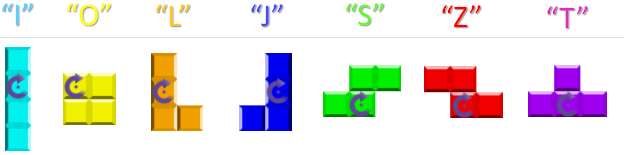

# QtTetris
Совместный проект слушателей курса C++ Junior Developer: игра Tetris на Qt5

Цели:
-----
* Изучение возможностей графического интерфейса средствами Qt5 Widgets
 * Рисование на форме
 * Обработка нажатий кнопок
 * Сохранение в файл и загрузка из файла (QFile)
 * Настройки программы (QSettings)
 * Циклы игры, работа с QTimer
* Практическая тренировка навыков работы в команде 
* Совместное проектирование и дизайн программы
* Использованием системы контроля версий Git 
* Использование Bug-tracker (списка задач/багов) - встроенного в Github.

[О тетрисе в Википедии](https://ru.wikipedia.org/wiki/%D0%A2%D0%B5%D1%82%D1%80%D0%B8%D1%81)

7 тетраминошек: Z S L J O I T 
-----------------------------


```
##    ##  #   #  ##  #  ###
 ##  ##   #   #  ##  #   #
          ## ##      #
                     #
```
